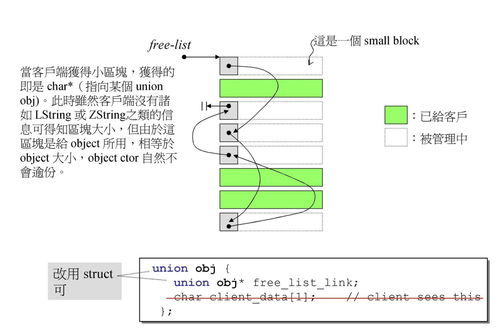

# **jjhou, yyds!**

## Reference 
- https://www.bilibili.com/video/BV1Kb411B7N8?p=12
- https://github.com/haotianmichael/Algorithm/blob/master/C%2B%2B/docs/MemoryManagement.md
- STL源码剖析


## Allocator
### Prerequisites
- some files
 - per_class_allocator1
 - per_class_allocator2
 - static_allocator3
 - macro_allocator4

- embedded pointer
```
union obj{
    union obj* next;
    char client_data[1];    
}
```
We only use _next_ when allocating or deallocating the memory, so it's smart to use the embedded pointer. 





### Two allocators
SGI offers two allocators, _malloc_alloc_template and _default_alloc_template. 


- free_list. 


For every block in free_list, it allocates 20 * 2 * blocksize(e.g, 32) when initialization. 20 for use and 20 for memory pool. 

- memory pool

when the node of free_list is empty, we apply some memory for use, and some for memory pool. e.g, we apply 32 * 20 * 2 bytes memory, and we first cut 32 bytes for every block, so we have 32 * 20 bytes for use and 32 * 20 for rest. Then we want 64 bytes for each block, so we cut the rest 32 * 20 bytes, and we get 10 blocks. **Note** that the number of blocks that cut from memory pool varies from 0 to 20. 

- tricks for allocating memory
...


- allocate()
- deallocate()
- refill()
- chunk_alloc()


